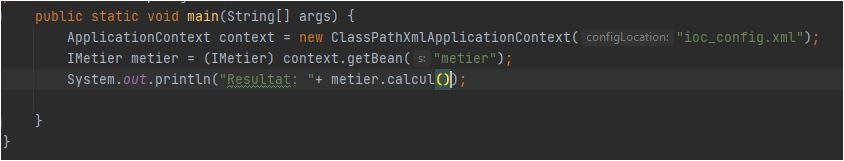
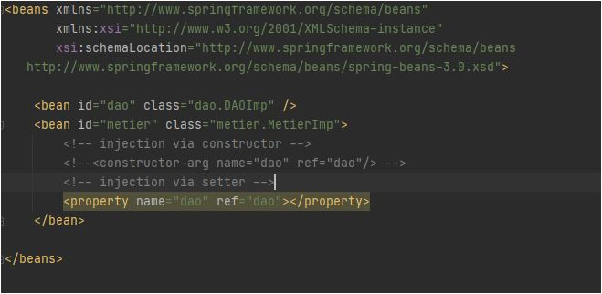
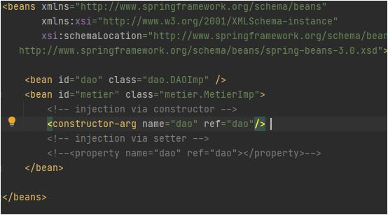
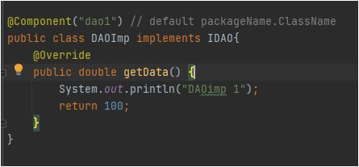
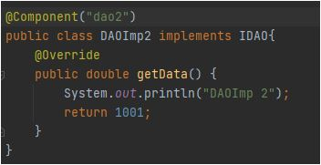
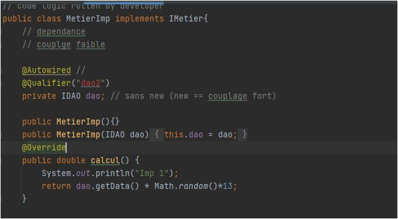
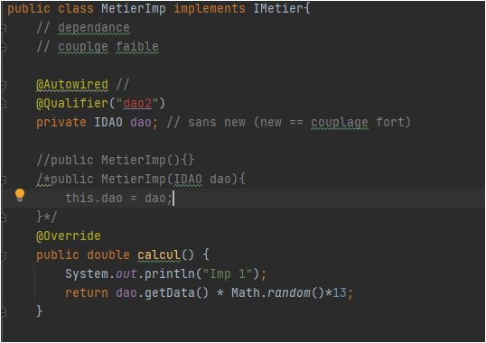

## Implementation of Dependency injection using Spring framework

`Rule 1 : A perfect application must be closed to modification and open to extension (Une application parfaite doit être fermée à la modification et ouverte à l'extension), and to achieve that we use inverstion of control (IoC) and Dependency injection using a softdependency (Couplage faible) instead of hardependency (Couplage fort) which is limit the maintenablity and the extensensibility of our application `

### Structer to be implemented

.

### Using XML configuartion file

configuration XML file.
.
Injecting by property.
.
Injecting constructor.
.

Main.

```
ApplicationContext context = new ClassPathXmlApplicationContext("ioc_config.xml");
        IMetier metier = (IMetier) context.getBean("metier");
        System.out.println("Resultat: "+ metier.calcul());
```

### Using Annotations

Component 1.

.

Compoenent 2.

.

Injecting using @Autowired & @Qualifier().

.

.

Main.

```
ApplicationContext context = new AnnotationConfigApplicationContext("dao", "metier"); // packages to look into
        IMetier metier = context.getBean(IMetier.class);
        // injection by constructor

        System.out.println("Result: "+ metier.calcul());
```
