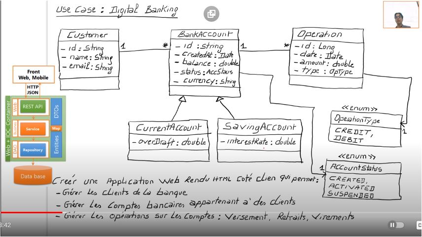

| ENSET-M | II-BDCC | Architecture JEE et Middlewares | 2022 | _Essadeq ELAAMIRI_ |
| ------- | ------- | ------------------------------- | ---- | ------------------ |

# Architecture Web rendu côté client

### Notes

Il y a deux modèles d'authentification:

- **Statefull**: basé sur les sessions et les coockies, les sessions des utilisateurs sont gérés par le serveur.
- **Stateless**:

| Le server-side rendering (SSR)                                                                                                                                                                                                                                                                                                                                                                                                                                                                                                                                                                                            | ## Client-Side-Rendering (CSR)                                                                                                                                                                                                                                                                                                                                                                                                                                                                                                          |
| ------------------------------------------------------------------------------------------------------------------------------------------------------------------------------------------------------------------------------------------------------------------------------------------------------------------------------------------------------------------------------------------------------------------------------------------------------------------------------------------------------------------------------------------------------------------------------------------------------------------------- | --------------------------------------------------------------------------------------------------------------------------------------------------------------------------------------------------------------------------------------------------------------------------------------------------------------------------------------------------------------------------------------------------------------------------------------------------------------------------------------------------------------------------------------- |
| Le server-side scripting exige que le serveur livre des pages HTML préchargées pour chaque demande. Quand un client envoie continuellement d’autres demandes au serveur Web pour envoyer des informations actualisées à l’utilisateur, cela se traduit par une **sollicitation élevée de la capacité du serveur**. Par conséquent, le SSR ne convient pas aux sites Web qui présentent un grand nombre de demandes ou qui nécessitent un grand nombre d’interactions avec les utilisateurs. Pour de tels projets, le **temps de réponse du serveur Web** annulerait l’avantage offert par le chargement de page optimisé. | Le CSR constitue une approche intéressante, en particulier pour les **projets Web présentant beaucoup d’interactions avec les utilisateurs**. Si le processus de chargement initial du site Web est relativement long, le **rendu des pages suivantes en est d’autant plus rapide**. L’expérience utilisateur est beaucoup plus avantageuse qu’avec le server-side rendering, car tous les scripts et les contenus ne doivent pas être chargés d’une seule reprise et entièrement à chaque appel d’une nouvelle page par l’utilisateur. |

#### Rest vs SOAP

### Angular

[Tutorial by tektutorialshub](https://www.tektutorialshub.com/angular-tutorial/)

[Official doc](https://angular.io/docs)

### SPA (Single page application)

Une application à page unique est une application qui interagit avec les utilisateurs en réécrivant les pages Web existantes avec de nouvelles données provenant du serveur Web, au lieu d’utiliser la technique par défaut du navigateur qui exécute une toute nouvelle page.

L’objectif est d’avoir des transitions plus rapides qui peuvent faire en sorte que le site se sente plus comme une application inhérente.

Dans un SPA, tout le code HTML, JavaScript et CSS requis est soit récupéré par le navigateur, soit des ressources appropriées qui sont chargées et ajoutées aux pages selon les besoins. Cela se produit généralement en réponse aux actions de l’utilisateur.

**SPA – Ajax et JavaScript**

Le cœur d’un SPA est basé sur Ajax, un ensemble de techniques de développement qui permet au client d’envoyer et de récupérer des données du serveur de manière asynchrone (en arrière-plan) sans interférer avec l’affichage et le comportement de la page web. Ajax permet aux pages web et, par extension, aux applications web, de modifier le contenu de manière dynamique sans avoir à recharger la page entière.

Pour ce faire, les SPA s’appuient fortement sur JavaScript qui s’exécutent dans le navigateur du client. Les frameworks JavaScript tels que React, Vue, Angular, Svelte, et Ember sont chargés de s’occuper du gros travail côté client.

### DTO (Data Transfer Object)

#### Problématique

> L'utilisation des entités JPA dans toutes les couches de l'application c'est pas forcement une bonne pratique. Notamment dans les situation où on généré des données qu'on va pas les utiliser (Le cas d'une application web qu'a besoins de 3 attributs seulement de L'employé, et qui reçoit 14 par le serveur).

#### Solution

Utiliser les entités JPA juste dans la couche `DAO` et la couche `Metier`, et on va utiliser le pattern `DTO` (Data transfer Object).

=> DTO mapping Frameworks : [mapstruct](https://mapstruct.org/documentation/installation/).

## Cas d'utilisation Digital banking

**Details**

On souhaite créer une application Web basée sur Spring et Angular qui permet de gérer des comptes bancaires. Chaque compte appartient à un client il existe deux types de comptes : Courant et Epargnes. chaque Compte peut subir des opérations de types Débit ou crédit.
L'application se compose des couches suivantes :

- Couche DAO (Entités JPA et Repositories)
- Couche Service définissant les opérations suivantes :
  - Ajouter des comptes
  - Ajouter des client
  - Effectuer un débit (Retrait)
  - Effectuer un crédit (Versement)
  - Effectuer un virement
  - Consulter un compte
- La couche DTO
- Mappers (DTO <=>Entities)
- La couche Web (Rest Controllers)
- Couche sécurité (Spring Security avec JWT)

Première partie du projet

Travail à faire :

1. Créer et tester la couche DAO
2. Créer et tester la couche service
3. Créer et tester la couche Web (Rest Controller)
4. Modifier la couche service et la couche web en utilisant les DTO
5. Créer un service d'authentification séparé basé sur Spring Security et JWT
6. Sécuriser l'application Digital Banking en utilisant Spring Security et JWT
7. Créer la partie Frontend Web en utilisant Angular
8. Créer la partie Frontend Mobile avec Flutter

#### Implémentation 01:04:00
