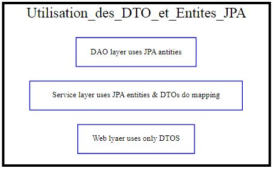

| ENSET-M | II-BDCC | Architecture JEE et Middlewares | 2022 | _Essadeq ELAAMIRI_ |
| ------- | ------- | ------------------------------- | ---- | ------------------ |

# Architecture Web rendu côté client

### Notes

Il y a deux modèles d'authentification:

- **Statefull**: basé sur les sessions et les coockies, les sessions des utilisateurs sont gérés par le serveur.

- **Stateless**:

| Le server-side rendering (SSR)                                                                                                                                                                                                                                                                                                                                                                                                                                                                                                                                                                                            | Client-Side-Rendering (CSR)                                                                                                                                                                                                                                                                                                                                                                                                                                                                                                             |
| ------------------------------------------------------------------------------------------------------------------------------------------------------------------------------------------------------------------------------------------------------------------------------------------------------------------------------------------------------------------------------------------------------------------------------------------------------------------------------------------------------------------------------------------------------------------------------------------------------------------------- | --------------------------------------------------------------------------------------------------------------------------------------------------------------------------------------------------------------------------------------------------------------------------------------------------------------------------------------------------------------------------------------------------------------------------------------------------------------------------------------------------------------------------------------- |
| Le server-side scripting exige que le serveur livre des pages HTML préchargées pour chaque demande. Quand un client envoie continuellement d’autres demandes au serveur Web pour envoyer des informations actualisées à l’utilisateur, cela se traduit par une **sollicitation élevée de la capacité du serveur**. Par conséquent, le SSR ne convient pas aux sites Web qui présentent un grand nombre de demandes ou qui nécessitent un grand nombre d’interactions avec les utilisateurs. Pour de tels projets, le **temps de réponse du serveur Web** annulerait l’avantage offert par le chargement de page optimisé. | Le CSR constitue une approche intéressante, en particulier pour les **projets Web présentant beaucoup d’interactions avec les utilisateurs**. Si le processus de chargement initial du site Web est relativement long, le **rendu des pages suivantes en est d’autant plus rapide**. L’expérience utilisateur est beaucoup plus avantageuse qu’avec le server-side rendering, car tous les scripts et les contenus ne doivent pas être chargés d’une seule reprise et entièrement à chaque appel d’une nouvelle page par l’utilisateur. |


#### Rest vs SOAP


Othrers


### Angular

[Tutorial by tektutorialshub](https://www.tektutorialshub.com/angular-tutorial/)

[Official doc](https://angular.io/docs)

### SPA (Single page application)

Une application à page unique est une application qui interagit avec les utilisateurs en réécrivant les pages Web existantes avec de nouvelles données provenant du serveur Web, au lieu d’utiliser la technique par défaut du navigateur qui exécute une toute nouvelle page.

L’objectif est d’avoir des transitions plus rapides qui peuvent faire en sorte que le site se sente plus comme une application inhérente.

Dans un SPA, tout le code HTML, JavaScript et CSS requis est soit récupéré par le navigateur, soit des ressources appropriées qui sont chargées et ajoutées aux pages selon les besoins. Cela se produit généralement en réponse aux actions de l’utilisateur.

**SPA – Ajax et JavaScript**

Le cœur d’un SPA est basé sur Ajax, un ensemble de techniques de développement qui permet au client d’envoyer et de récupérer des données du serveur de manière asynchrone (en arrière-plan) sans interférer avec l’affichage et le comportement de la page web. Ajax permet aux pages web et, par extension, aux applications web, de modifier le contenu de manière dynamique sans avoir à recharger la page entière.

Pour ce faire, les SPA s’appuient fortement sur JavaScript qui s’exécutent dans le navigateur du client. Les frameworks JavaScript tels que React, Vue, Angular, Svelte, et Ember sont chargés de s’occuper du gros travail côté client.

### DTO (Data Transfer Object)

#### Problématique

> L'utilisation des entités JPA dans toutes les couches de l'application c'est pas forcement une bonne pratique. Notamment dans les situation où on généré des données qu'on va pas les utiliser (Le cas d'une application web qu'a besoins de 3 attributs seulement de L'employé, et qui reçoit 14 par le serveur).

#### Solution

Utiliser les entités JPA juste dans la couche `DAO` et la couche `Metier`, et on va utiliser le pattern `DTO` (Data transfer Object).

=> DTO mapping Frameworks : [mapstruct](https://mapstruct.org/documentation/installation/).

## Cas d'utilisation Digital banking


**Details**

On souhaite créer une application Web basée sur Spring et Angular qui permet de gérer des comptes bancaires. Chaque compte appartient à un client il existe deux types de comptes : Courant et Epargnes. chaque Compte peut subir des opérations de types Débit ou crédit.

L'application se compose des couches suivantes :

- Couche DAO (Entités JPA et Repositories)

- Couche Service définissant les opérations suivantes :

- Ajouter des comptes

- Ajouter des client

- Effectuer un débit (Retrait)

- Effectuer un crédit (Versement)

- Effectuer un virement

- Consulter un compte

- La couche DTO

- Mappers (DTO <=>Entities)

- La couche Web (Rest Controllers)

- Couche sécurité (Spring Security avec JWT)

Première partie du projet

Travail à faire :

1. Créer et tester la couche DAO

2. Créer et tester la couche service

3. Créer et tester la couche Web (Rest Controller)

4. Modifier la couche service et la couche web en utilisant les DTO

5. Créer un service d'authentification séparé basé sur Spring Security et JWT

6. Sécuriser l'application Digital Banking en utilisant Spring Security et JWT

7. Créer la partie Frontend Web en utilisant Angular

8. Créer la partie Frontend Mobile avec Flutter

#### Implémentation

_Dépendences_

```xml

<dependencies>

  <dependency>

      <groupId>org.springframework.boot</groupId>

      <artifactId>spring-boot-starter-data-jpa</artifactId>

  </dependency>

  <dependency>

      <groupId>org.springframework.boot</groupId>

      <artifactId>spring-boot-starter-web</artifactId>

  </dependency>

  <dependency>

      <groupId>com.h2database</groupId>

      <artifactId>h2</artifactId>

      <scope>runtime</scope>

  </dependency>

  <dependency>

      <groupId>org.projectlombok</groupId>

      <artifactId>lombok</artifactId>

      <optional>true</optional>

  </dependency>

  <dependency>

      <groupId>org.springframework.boot</groupId>

      <artifactId>spring-boot-starter-test</artifactId>

      <scope>test</scope>

  </dependency>

</dependencies>

```

_Structure du projet_


#### Couche DAO

_Héritage_

Pour gérer l'héritage, on peut utiliser une des trois stratégies:

- _**Single table**_: une seule table va contenir tous les attributs des 3 classes, elle utilise <span  style="color:red;text-decoration:underline">discriminator column</span> pour différencier entre les deux sous types.

Rapide mais, limitée par les valeurs nulles (et les champs non utilisé).

- _**Table per class**_ (la plus utilisée): 2 table, une pour chaque sous type. Rapide par rapport au 'Joined table', mais limitée par la redondance des champs et donc n'est pas plus optimisée au côté mémoire.

Utilisable lorsque on a une grande différence entres les classes (Moins d'attributs communs).

- _**Joined table**_: 3 table, une pour la classe mère, et deux autres pour les sous classes (avec un clé étrangère vers la table base).

> **trick**:

> Comment choisir ?

> Commencer par signle Table (Rapide),

> Vous avez une nombre important des champs nuls (15, 20 ..)?

> Pensez à Table per class si il y a une grande différence entres les classes (Moins d'attributs communs).

> Si non, juste un peu de différence, utilisez Joined table.

Here is a simple flow chart:


_bankAccount_

```java
@Data
@AllArgsConstructor
@NoArgsConstructor
@Entity
@Inheritance(strategy = InheritanceType.SINGLE_TABLE)
@DiscriminatorColumn(name = "TYPE", length = 4, discriminatorType = DiscriminatorType.STRING)// string deault
public class BankAccount {
    @Id
    private String id;
    @DateTimeFormat(pattern = "YYYY-MM-DD")
    private Date createdAt;
    private double balance;
    private AccountStatus status;
    private String currency;

    @ManyToOne()
    private Customer customer;

    @OneToMany(mappedBy = "bankAccount")
    private List<AccountOperation> accountOperationList;

}
```

_SavingAccount_

```java
@Data
@AllArgsConstructor
@NoArgsConstructor
@Entity
@DiscriminatorValue("SAV")
public class SavingAccount extends BankAccount {
    private double interestRate; // taux d'interêt
}

```

_CurrentAccount_

```java
@Data
@AllArgsConstructor
@NoArgsConstructor
@Entity
@DiscriminatorValue("CURR")
public class CurrentAccount extends BankAccount{
    private double overDraft;
}
```

=> Tous les entitées : [lien](https://github.com/essadeq-elaamiri/ELAAMIRI_JEE/tree/main/digitalBanking/ebank-backend/src/main/java/com/elaamiri/ebankbackend/entities)

Pour tester, on utilisant la base de données H2:

_application.properties_

```properties
spring.datasource.url=jdbc:h2:mem:ebank
spring.h2.console.enabled=true
server.port=8085
```

Visitons le console H2 via: `http://localhost:8085/h2-console/`


Testons nos repositories:

<details>

```java
@Bean
    CommandLineRunner run(CustomerRepository customerRepository,
                          BankAccountRepository bankAccountRepository,
                          AccountOperationRepository accountOperationRepository){
        return (args)->{
            Stream.of("Hassan", "Laila", "Samia", "Ali").forEach( name -> {
                Customer customer = new Customer();
                customer.setId(UUID.randomUUID().toString());
                customer.setName(name);
                customer.setEmail(name.concat("@gmail.com"));

                customerRepository.save(customer);

            });
            customerRepository.findAll().forEach( customer -> {
                // create a currentAccount and a savingAccount or each customer
                CurrentAccount currentAccount = new CurrentAccount();
                currentAccount.setId(UUID.randomUUID().toString());
                currentAccount.setCurrency("MDH");
                currentAccount.setBalance(Math.random()*5000);
                currentAccount.setCreatedAt(new Date());
                currentAccount.setStatus(AccountStatus.values()[(int)(Math.random()*3)]);
                currentAccount.setOverDraft(2000);
                currentAccount.setCustomer(customer);

                SavingAccount savingAccount = new SavingAccount();
                savingAccount.setId(UUID.randomUUID().toString());
                savingAccount.setCurrency("MDH");
                savingAccount.setBalance(Math.random()*5000);
                savingAccount.setCreatedAt(new Date());
                savingAccount.setStatus(AccountStatus.values()[(int)(Math.random()*3)]);
                savingAccount.setInterestRate(Math.random()* 10);
                savingAccount.setCustomer(customer);

                bankAccountRepository.save(currentAccount);
                bankAccountRepository.save(savingAccount);
            });

            bankAccountRepository.findAll().forEach(bankAccount -> {
                // créer 3 opérations pour chaque compte
                for(int i=1; i<=3; i++){
                    AccountOperation accountOperation = new AccountOperation();
                    accountOperation.setBankAccount(bankAccount);
                    accountOperation.setOperationType(OperationType.values()[(int)(Math.random()*2)]);
                    accountOperation.setAmount(Math.random()*300);
                    accountOperation.setDate(new Date());

                    accountOperationRepository.save(accountOperation);
                }
            });
        };
    }
```

</details>
Resultats:


> Note: Spring JPA, ne crée pas une table SQL pour une Classe Abstraite (Abstract Class).

Basculer vers MySQL:

Dependence

```xml
        <dependency>
            <groupId>mysql</groupId>
            <artifactId>mysql-connector-java</artifactId>
        </dependency>
```

application.properties

```properties
# data base cofig
spring.datasource.url=jdbc:mysql://localhost:3306/ebank?createDatabaseIfNotExist=true
spring.datasource.username=root
spring.datasource.password=
# dialect
spring.jpa.properties.hibernate.dialect = org.hibernate.dialect.MariaDBDialect
# ddl
spring.jpa.hibernate.ddl-auto=update
```

#### Couche Service

Décrire les diférentes fonctionnalités de l'application.

Structure:


`@Transactional` dans chaque classe Service, rend tous ces opérations transactionnelles, dans ce cas, Spring va toujour commancer la transaction, si tout est bien il la confime (Commit), si non (Exception par exemple), il va annuler les modification (rollback).

Exemple Interface `BankAccountService` et son implémentaion:

```java
@Service

public interface BankAccountService {
    CurrentAccount saveCurrentAccount(double initBalance, double overDraft, String customerId);
    SavingAccount saveSavingAccount(double initBalance, double interestRate, String customerId);
    BankAccount saveAccount(BankAccount bankAccount) throws AccountNotFoundException;
    boolean deleteAccount(String accountId) throws AccountNotFoundException;
    BankAccount updateAccount(BankAccount bankAccount) throws AccountNotFoundException;

    List<BankAccount> getBankAccountsList(int page, int size);

    BankAccount getBankAccountById(String accountId) throws AccountNotFoundException;

    AccountType getAccountType(String accountId) throws AccountNotFoundException;

    boolean applyOperation(String accountId, double amount, OperationType operationType, String description) throws OperationFailedException, AccountNotFoundException, CustomerNotFoundException, BalanceNotSufficientException;

    boolean debitAccount(BankAccount account, double amount, String description) throws OperationFailedException, AccountNotFoundException, BalanceNotSufficientException, CustomerNotFoundException;
    boolean creditAccount(BankAccount account, double amount, String description) throws AccountNotFoundException, CustomerNotFoundException;// retrait
    boolean transfer(String sourceAccount, String destinationAccount, double amountToTransfer) throws AccountNotFoundException, OperationFailedException, CustomerNotFoundException, BalanceNotSufficientException;

}

```

`BankAccountServiceImp.java`

<details>
<legend>BankAccountServiceImp</legend>

```java
@Service
@Transactional
@AllArgsConstructor
@Slf4j // get log attribute (by lombok)
public class BankAccountServiceImp implements BankAccountService {
    BankAccountRepository bankAccountRepository;
    CustomerService customerService;
    AccountOperationService accountOperationService;

    //Logger log = LoggerFactory.getLogger(this.getClass().getName()); // done by lombok


    @Override
    public CurrentAccount saveCurrentAccount(double initBalance, double overDraft, String customerId){
        log.info("Saving currentAccount ...");
        Customer customer = customerService.getCustomerById(customerId);
        CurrentAccount bankAccount =  new CurrentAccount();
        bankAccount.setId(UUID.randomUUID().toString());
        bankAccount.setBalance(initBalance);  // must be validated
        bankAccount.setCustomer(customer);
        bankAccount.setCreatedAt(new Date());
        bankAccount.setOverDraft(overDraft);
        return bankAccountRepository.save(bankAccount);

    }
    @Override
    public SavingAccount saveSavingAccount(double initBalance, double interestRate, String customerId){
        log.info("Saving savingAccount ...");
        Customer customer = customerService.getCustomerById(customerId);
        SavingAccount bankAccount =  new SavingAccount();
        bankAccount.setId(UUID.randomUUID().toString());
        bankAccount.setBalance(initBalance);  // must be validated
        bankAccount.setCustomer(customer);
        bankAccount.setCreatedAt(new Date());
        bankAccount.setInterestRate(interestRate);
        return bankAccountRepository.save(bankAccount);
    }


    @Override
    public BankAccount saveAccount(BankAccount bankAccount) throws AccountNotFoundException {
        log.info("Saving account ....");
        if(bankAccount == null) throw new AccountNotFoundException("Invalid account [NULL]");
        bankAccount.setId(UUID.randomUUID().toString());
        return bankAccountRepository.save(bankAccount);
    }

    @Override
    public boolean deleteAccount(String accountId) throws AccountNotFoundException {
        log.info("Deleting account ....");
        BankAccount account =  getBankAccountById(accountId);
        bankAccountRepository.delete(account);
        return true;
    }

    @Override
    public BankAccount updateAccount(BankAccount bankAccount) throws AccountNotFoundException {
        log.info("Updating account ....");
        BankAccount account =  getBankAccountById(bankAccount.getId());
        return saveAccount(bankAccount);
    }

    @Override
    public List<BankAccount> getBankAccountsList(int page, int size) {
        return null;
    }

    @Override
    public BankAccount getBankAccountById(String accountId) throws AccountNotFoundException {
        log.info("Selecting an account ....");
        return bankAccountRepository.findById(accountId).orElseThrow(() -> new AccountNotFoundException(null));
    }

    @Override
    public AccountType getAccountType(String accountId) throws AccountNotFoundException {
        log.info("Getting an account type....");
        BankAccount account = getBankAccountById(accountId);
        if(account instanceof  CurrentAccount) return AccountType.CURRENT_ACCOUNT;
        else if(account instanceof SavingAccount) return AccountType.SAVING_ACCOUNT;
        return null;
    }

    @Override
    public boolean applyOperation(String accountId, double amount, OperationType operationType, String description) throws OperationFailedException, AccountNotFoundException, CustomerNotFoundException, BalanceNotSufficientException {
        log.info("Applying an operation....");
        BankAccount account = getBankAccountById(accountId);

        if(amount <= 0) throw  new OperationFailedException("Operation Failed, amount <= 0 !");
        // pass operation
        if(operationType.equals(OperationType.CREDIT)){
            creditAccount(account, amount, description);
        }
        else if (operationType.equals(OperationType.DEBIT)) {
            debitAccount(account, amount, description);
        }
        return true;
    }

    @Override
    public boolean debitAccount(BankAccount account, double amount, String description) throws BalanceNotSufficientException, AccountNotFoundException, CustomerNotFoundException {
        log.info("Applying a debit....");
        double balance = account.getBalance();
        if(balance < amount) throw new BalanceNotSufficientException("Operation Failed, balance < amount !");

        // create the operation
        AccountOperation accountOperation = new AccountOperation();
        accountOperation.setOperationType(OperationType.DEBIT);
        accountOperation.setBankAccount(account);
        accountOperation.setDate(new Date());
        accountOperation.setAmount(amount);
        accountOperation.setDescription(description);
        accountOperation.setBankAccount(account);

        // save operation
        accountOperationService.saveOperation(accountOperation);
        // update account data

        account.setBalance(balance - amount);
        updateAccount(account);

        return true;
    }

    @Override
    public boolean creditAccount(BankAccount account, double amount, String description) throws AccountNotFoundException, CustomerNotFoundException {
        log.info("Applying a credit....");

        double balance = account.getBalance();
        // create the operation
        AccountOperation accountOperation = new AccountOperation();
        accountOperation.setOperationType(OperationType.CREDIT);
        accountOperation.setBankAccount(account);
        accountOperation.setDate(new Date());
        accountOperation.setAmount(amount);
        accountOperation.setDescription(description);
        accountOperation.setBankAccount(account);
        // save operation
        accountOperationService.saveOperation(accountOperation);
        // update account data

        account.setBalance(balance + amount);
        //account.getAccountOperationList().add(accountOperation);
        updateAccount(account);


        return true;
    }

    @Override
    public boolean transfer(String sourceAccount, String destinationAccount, double amountToTransfer) throws AccountNotFoundException, OperationFailedException, CustomerNotFoundException, BalanceNotSufficientException {
        log.info("Applying a transfer....");

        final  String description = "Transfer operation from ".concat(sourceAccount).concat(" To ").concat("destination");
        // Making sure that the two are there (Before any operation)
        getBankAccountById(sourceAccount);
        getBankAccountById(destinationAccount);

        applyOperation(sourceAccount, amountToTransfer, OperationType.DEBIT, description);
        applyOperation(destinationAccount, amountToTransfer, OperationType.CREDIT, description);

        return false;
    }
}

```

</details>

**Tests Service layer**

```java
@Bean
    CommandLineRunner TestingService(CustomerService customerService, BankAccountService bankAccountService){
        return (args)->{
            // creating an customer
            Customer customer = new Customer();
            customer.setName("Hajji Ilham");
            customer.setEmail("email@emal.cm");
            customer = customerService.saveCustomer(customer);

            // update customer
            customer.setName("Hajji Ilham idrissi");
            customer = customerService.updateCustomer(customer);


            // creating an account
            BankAccount b1 = bankAccountService.saveCurrentAccount(79000,310, customer.getId());
            BankAccount b2 =  bankAccountService.saveSavingAccount(79000,3.10, customer.getId());

            // operations
            bankAccountService.applyOperation(b1.getId(),12990, OperationType.DEBIT, "Debit");
            bankAccountService.applyOperation(b1.getId(),1000, OperationType.CREDIT, "Credit");
            bankAccountService.applyOperation(b1.getId(),-1000, OperationType.CREDIT, "Credit");


            bankAccountService.transfer(b1.getId(), b2.getId(), 23990);

        };
    }
```


Après la correction det l'erreur 'Amount <= 0':


#### Couche Web

La relation bidirectionnelle entre Customer et Account, génère le problème de `Dependence cyclique`
Les solutions possibles:


1. Utilise l'annotation `@JsonProperty` de `com.fasterxml.jackson.annotation.JsonProperty` au-dessus de l'attribut `bankAccountList` de `Customer`, pour éviter de serialiser l'attribut en format Json.

```java
    @OneToMany(mappedBy = "customer")// the same name used in BankAccount
    // mappedBy assist the bidirectional association
    @JsonProperty(access = JsonProperty.Access.WRITE_ONLY)
    private List<BankAccount> bankAccountList;
```

2. Utiliser les DTOs [Best practice]
   DTO : Datat Transfer Object
   Ils permet de choisir uniquement les attributs qui m'intéresse parmit les attributs de l'entité.
   On va avoir besion d'une couche qui fait le 'mapping' entre les entités et les DTOs.

Customer Entity:

```java
@Data
@AllArgsConstructor
@NoArgsConstructor
@Entity
public class Customer {
    @Id
    private String id;
    private String name;
    private String email;

    @OneToMany(mappedBy = "customer")// the same name used in BankAccount
    // mappedBy assist the bidirectional association
    @JsonProperty(access = JsonProperty.Access.WRITE_ONLY)
    private List<BankAccount> bankAccountList;

}
```

CustomerDTO

```java
@Data
public class CustomerDTO {
    private String id;
    private String name;
    private String email;

}
```

Mapper (Version pénible)

```java
public class BankMapperImp implements BankMapper{

    @Override
    //map Customer to CustomerDTO
    public CustomerDTO dtoFromCustomer(Customer customer){
        CustomerDTO customerDTO = new CustomerDTO();
        customerDTO.setId(customer.getId());
        customerDTO.setName(customer.getName());
        customerDTO.setEmail(customer.getEmail());
        return customerDTO;
    }


    @Override
    public Customer customerFromDTO(CustomerDTO customerDTO){
        Customer customer = new Customer();
        customer.setId(customerDTO.getId());
        customer.setName(customerDTO.getName());
        customer.setEmail(customerDTO.getEmail());

        return customer;
    }

}

```

Il vaut mieux d'utiliser `BeanUtils.copyProperties()`

```java
@Service
public class BankMapperImp implements BankMapper{

    @Override
    //map Customer to CustomerDTO
    public CustomerDTO dtoFromCustomer(Customer customer){
        CustomerDTO customerDTO = new CustomerDTO();
        BeanUtils.copyProperties(customer, customerDTO);
        return customerDTO;
    }


    @Override
    public Customer customerFromDTO(CustomerDTO customerDTO){
        Customer customer = new Customer();
        BeanUtils.copyProperties(customerDTO, customer);
        return customer;
    }

}

```

Ou bien utiliser un framework pour cet objectif comme :

- [MapStruct](https://mapstruct.org/)

On utilise le mapper dans la couche service:

```java
@Override
    public List<CustomerDTO> getCustomersList(int page, int size, String keyword) {
        log.info("Selecting  customers ....");
        List<Customer> customersList = new ArrayList<>();
        // mapping
        if(keyword != null) customersList =  customerRepository.findCustomersByNameContains(keyword, PageRequest.of(page, size)).getContent();
        else customersList =  customerRepository.findAll( PageRequest.of(page, size)).getContent();

        return customersList.stream().map(customer -> {
            return bankMapper.dtoFromCustomer(customer);
        }).collect(Collectors.toList());
    }
```

Noter:



**Controlleur (exemple CustomerRestController)**

<details>
<legend>CustomerRestController</legend>

```java
@Service
@Transactional
@AllArgsConstructor
@Slf4j // get log attribute

public class CustomerServiceImp implements CustomerService {
    CustomerRepository customerRepository;
    BankMapper bankMapper;

    @Override
    public CustomerDTO saveCustomer(CustomerDTO customerDTo) throws CustomerNotFoundException {
        log.info("Saving customer ....");
        if(customerDTo == null) throw new CustomerNotFoundException("Invalid customer [NULL]");
        customerDTo.setId(UUID.randomUUID().toString());
        return  bankMapper.dtoFromCustomer(customerRepository.save(bankMapper.customerFromDTO(customerDTo)));
    }

    @Override
    public CustomerDTO updateCustomer(CustomerDTO customerDTO) throws CustomerNotFoundException {
        log.info("Updating customer ....");
        getCustomerById(customerDTO.getId());
        return bankMapper.dtoFromCustomer(customerRepository.save(bankMapper.customerFromDTO(customerDTO)));
    }

    @Override
    public boolean deleteCustomer(String customerId) throws CustomerNotFoundException {
        log.info("Deleting customer ....");
        CustomerDTO customerDTO =  getCustomerById(customerId);
        customerRepository.delete(bankMapper.customerFromDTO(customerDTO));
        return true;
    }

    @Override
    public CustomerDTO getCustomerById(String id) throws CustomerNotFoundException {
        log.info("Selecting a customer ....");
        Customer customer = customerRepository.findById(id).orElseThrow(() -> new CustomerNotFoundException(null));
        return bankMapper.dtoFromCustomer(customer);
    }

    @Override
    public List<CustomerDTO> getCustomersList(int page, int size, String keyword) {
        log.info("Selecting  customers ....");
        List<Customer> customersList = new ArrayList<>();
        // mapping
        if(keyword != null) customersList =  customerRepository.findCustomersByNameContains(keyword, PageRequest.of(page, size)).getContent();
        else customersList =  customerRepository.findAll( PageRequest.of(page, size)).getContent();

        return customersList.stream().map(customer -> {
            return bankMapper.dtoFromCustomer(customer);
        }).collect(Collectors.toList());
    }
}

```

</details>

### Documentation du RestAPI

Pour documenter notre API, on va utiliser [`Swagger` :link:](https://swagger.io/), [`OpenAPI` :link:](https://springdoc.org/)

OpenAPI c'est la vesrsion 3 de swagger.

Dependency:

```xml
 <dependency>
      <groupId>org.springdoc</groupId>
      <artifactId>springdoc-openapi-ui</artifactId>
      <version>1.6.8</version>
   </dependency>
```

OpenAPI (Swagger v3), nous donne une application web pour tester notre API.
Elle est sur: `http://localhost:8080/swagger-ui/index.html` et accessible par `localhost:8080/swagger-ui.html`


Et pour acceder la documentation de notre API, il suffit de tappez : `http://localhost:8080/v3/api-docs`

Voici son résultat:

<details>

```json
{
  "openapi": "3.0.1",
  "info": {
    "title": "OpenAPI definition",
    "version": "v0"
  },
  "servers": [
    {
      "url": "http://localhost:8080",
      "description": "Generated server url"
    }
  ],
  "paths": {
    "/customers/{id}": {
      "get": {
        "tags": ["customer-rest-controller"],
        "operationId": "getCustomer",
        "parameters": [
          {
            "name": "id",
            "in": "path",
            "required": true,
            "schema": {
              "type": "string"
            }
          }
        ],
        "responses": {
          "200": {
            "description": "OK",
            "content": {
              "*/*": {
                "schema": {
                  "$ref": "#/components/schemas/CustomerDTO"
                }
              }
            }
          }
        }
      },
      "put": {
        "tags": ["customer-rest-controller"],
        "operationId": "updateCustomer",
        "parameters": [
          {
            "name": "id",
            "in": "path",
            "required": true,
            "schema": {
              "type": "string"
            }
          }
        ],
        "requestBody": {
          "content": {
            "application/json": {
              "schema": {
                "$ref": "#/components/schemas/CustomerDTO"
              }
            }
          },
          "required": true
        },
        "responses": {
          "200": {
            "description": "OK",
            "content": {
              "*/*": {
                "schema": {
                  "$ref": "#/components/schemas/CustomerDTO"
                }
              }
            }
          }
        }
      },
      "delete": {
        "tags": ["customer-rest-controller"],
        "operationId": "deleteCustomer",
        "parameters": [
          {
            "name": "id",
            "in": "path",
            "required": true,
            "schema": {
              "type": "string"
            }
          }
        ],
        "responses": {
          "200": {
            "description": "OK"
          }
        }
      }
    },
    "/customers": {
      "get": {
        "tags": ["customer-rest-controller"],
        "operationId": "getCustomersList",
        "parameters": [
          {
            "name": "page",
            "in": "query",
            "required": false,
            "schema": {
              "type": "integer",
              "format": "int32",
              "default": 0
            }
          },
          {
            "name": "size",
            "in": "query",
            "required": false,
            "schema": {
              "type": "integer",
              "format": "int32",
              "default": 5
            }
          },
          {
            "name": "keyword",
            "in": "query",
            "required": false,
            "schema": {
              "type": "string",
              "default": ""
            }
          }
        ],
        "responses": {
          "200": {
            "description": "OK",
            "content": {
              "*/*": {
                "schema": {
                  "type": "array",
                  "items": {
                    "$ref": "#/components/schemas/CustomerDTO"
                  }
                }
              }
            }
          }
        }
      },
      "post": {
        "tags": ["customer-rest-controller"],
        "operationId": "saveCustomer",
        "requestBody": {
          "content": {
            "application/json": {
              "schema": {
                "$ref": "#/components/schemas/CustomerDTO"
              }
            }
          },
          "required": true
        },
        "responses": {
          "200": {
            "description": "OK",
            "content": {
              "*/*": {
                "schema": {
                  "$ref": "#/components/schemas/CustomerDTO"
                }
              }
            }
          }
        }
      }
    }
  },
  "components": {
    "schemas": {
      "CustomerDTO": {
        "type": "object",
        "properties": {
          "id": {
            "type": "string"
          },
          "name": {
            "type": "string"
          },
          "email": {
            "type": "string"
          }
        }
      }
    }
  }
}
```

</details>

Ces données là, décrivent la structure de notre web service, et comment elle fonctionne.

On peut tester notre web service avec Postman:
`import >> 'donner le URL: http://localhost:8080/v3/api-docs' >> .. `


Postman ensuite, créera une collection, pour tester l'API, il va detecter tout seul les requêtes à éxecuter.


v3
TODO: Backend

- [ ] Backend operation
- [ ] Rest update & delete things
