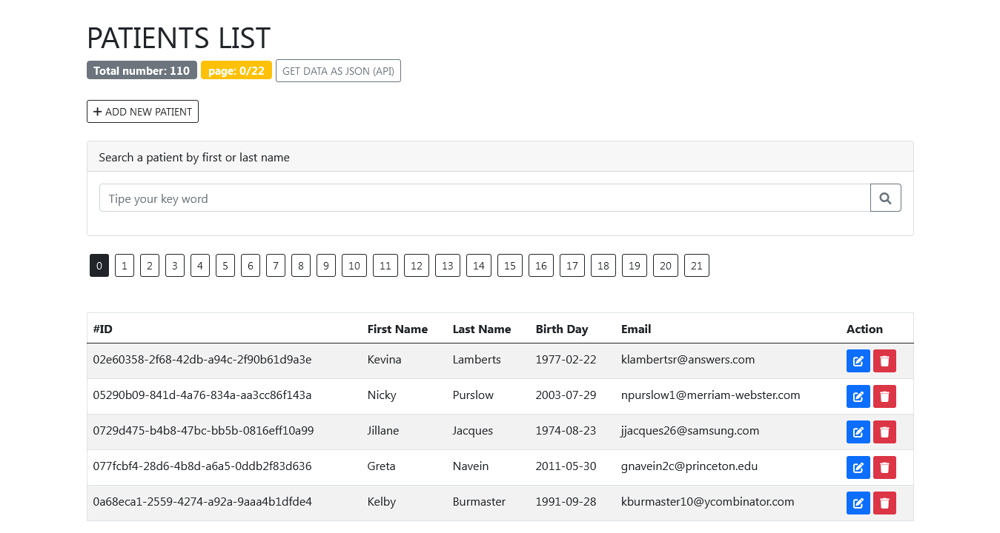
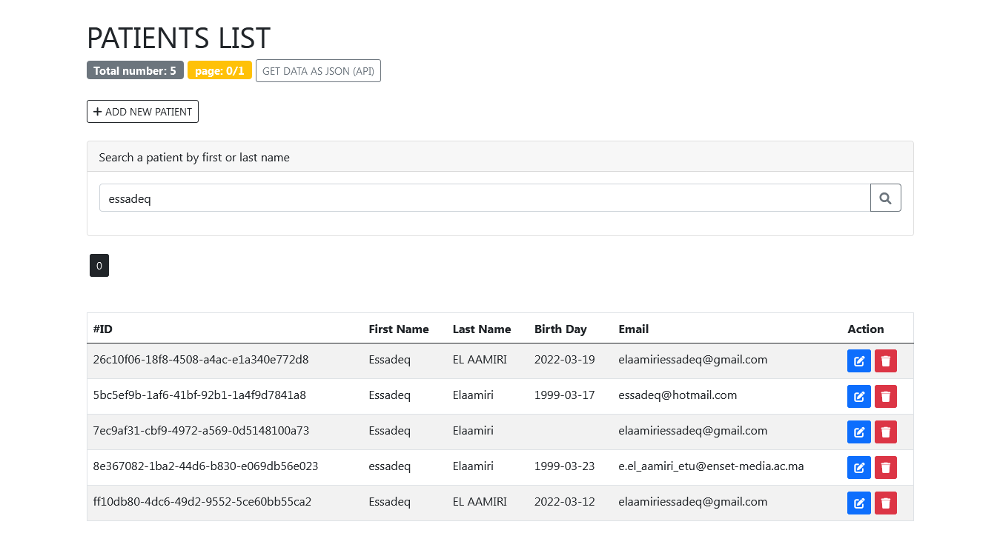
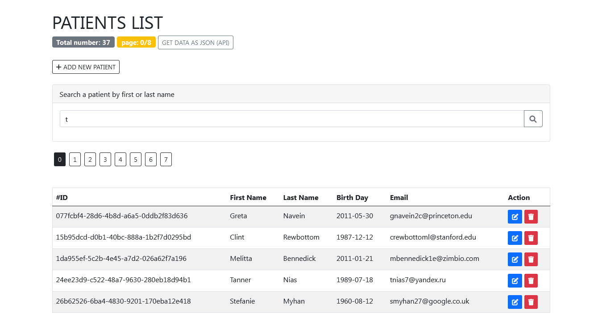
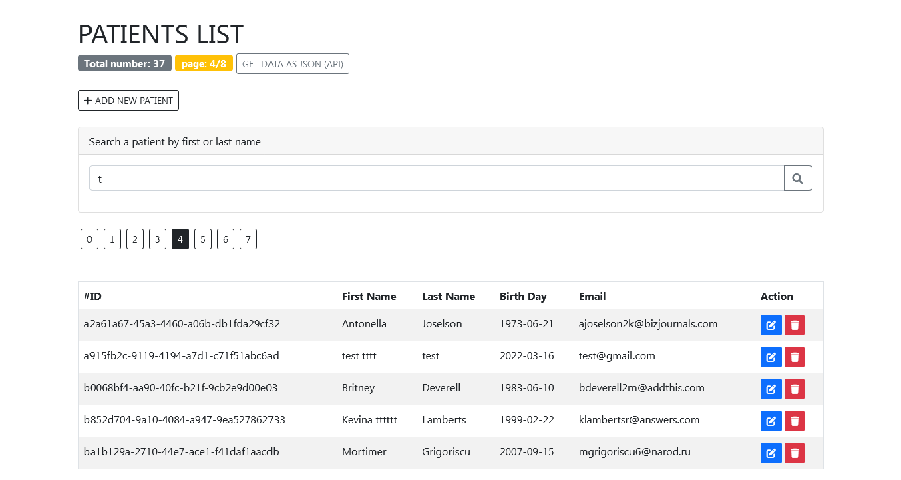
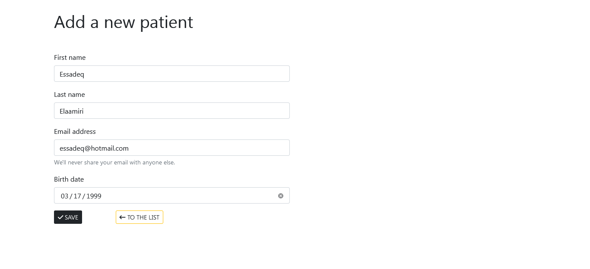
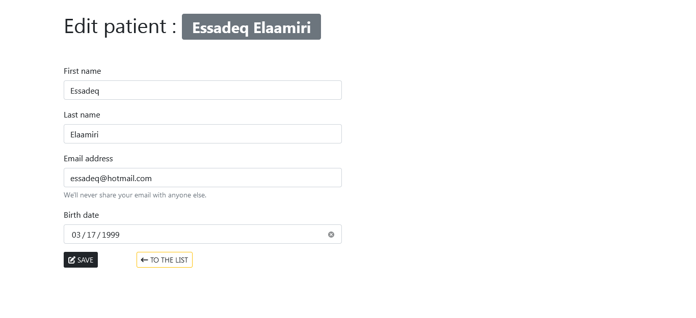
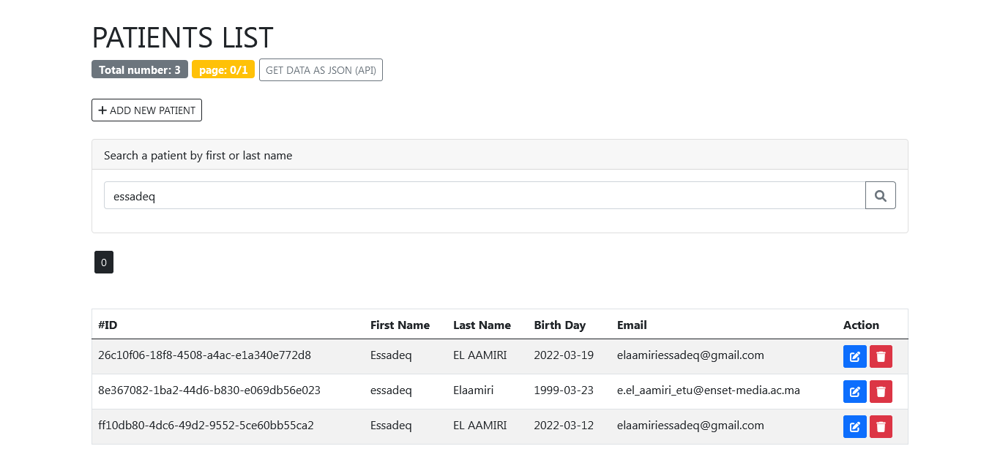
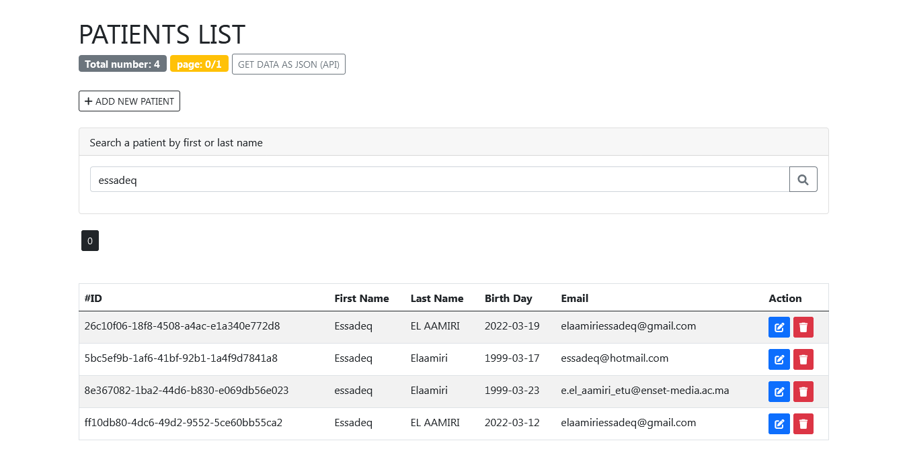
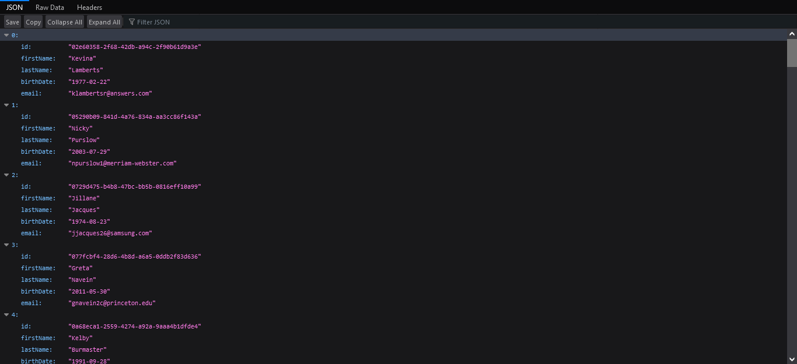

# Patients Managment App

A basic practical activity, using Java SpringBoot, Spring MVC/ thymeleaf and Spring Data JPA.

### fuctionalities:

#### [Watch demo on YouTube part 1](https://www.youtube.com/watch?v=9pyiKzWQSbs).

#### [Watch demo on YouTube part 2](https://youtu.be/qACOOJkGmAc).

1. List all patients

   

2. Search by keyword (first or last name) for patients

   

3. Search exemple with 't'

   

4. Navigating in results usng pagination

   

5. Insert patients

   

6. Update patients

   

7. After updating

   

8. After removing

   

9. Get results in JSON

   

### What did I get ?

1. Using Spring Data JPA to interact with database (Accessing data).
2. Using Spring MVC/ thymeleaf to interact and handle http requests.
3. Using Dependency injection.
4. Understanding how much thing become easier with Spring ecosystem
5. Thank you M.[Youssfi](https://github.com/mohamedYoussfi), and thank you [Spring](https://github.com/spring-projects).
