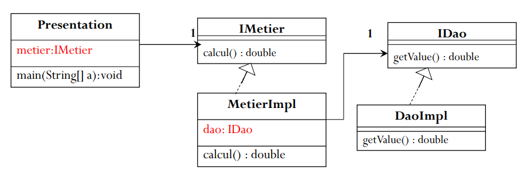
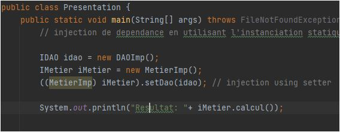
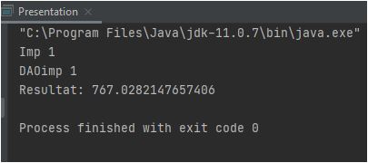
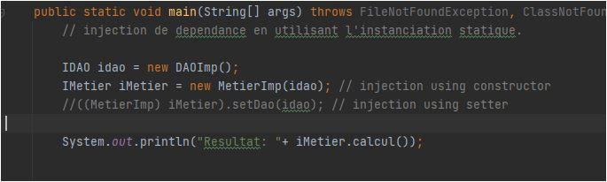
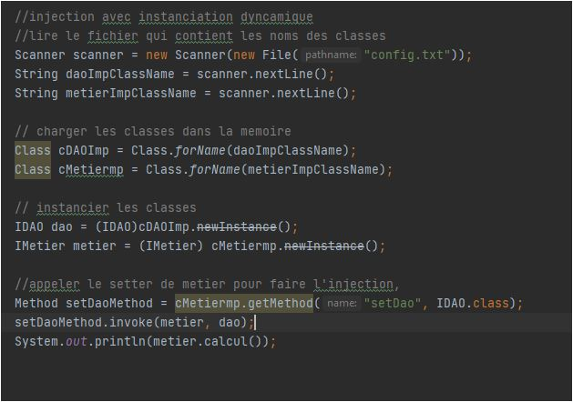
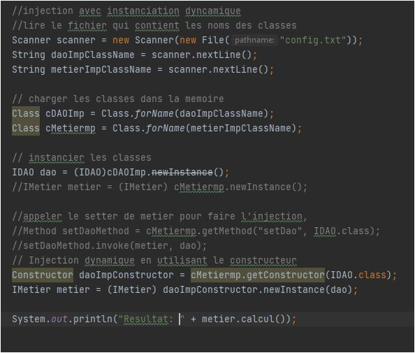

## Implementation of Dependency injection based on static and dynamic instanciation

`Rule 1 : A perfect application must be closed to modification and open to extension (Une application parfaite doit être fermée à la modification et ouverte à l'extension), and to achieve that we use inverstion of control (IoC) and Dependency injection using a softdependency (Couplage faible) instead of hardependency (Couplage fort) which is limit the maintenablity and the extensensibility of our application `

### Structer to be implemented

.

### Using Static instanciation

Injecting by setter.
.
Result.
.
Injecting by constructor.

.

### Using dynamic instanciation

Injecting by setter.

.
Injecting by constructor.

.
